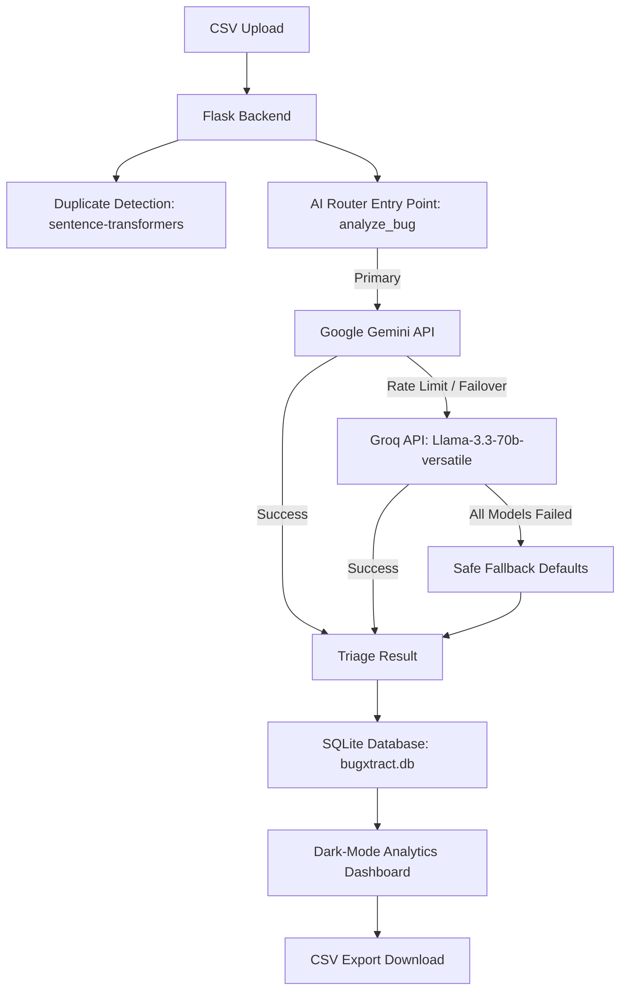

# BugXtract V2 – Enterprise AI-Powered Bug Triage Platform

BugXtract V2 is an enterprise-grade defect triage, routing, and analytics platform that utilizes advanced Large Language Models (LLMs) to automatically classify, prioritize, audit, and route bug reports submitted by various enterprise teams. 

The platform supports robust triage workflows for reports originating from:
* QA Team
* Testing Team
* IT Support Team
* Developer Team
* DevOps Team
* Security Team
* Infrastructure Team
* Data Engineering Team
* Compliance Team

---

## Project Overview

In complex enterprise software and cloud environments, manually reviewing and routing large lists of bug reports is slow and error-prone. BugXtract V2 solves this by importing team bug reports, performing automated duplicate detection and quality auditing, executing AI classification, and updating an interactive dark-mode analytics dashboard. 

---

## Key Features

* **CSV-Based Enterprise Bug Import**: Bulk upload bug report datasets in CSV format.
* **Source Team Detection from CSV**: Automatically reads and validates the `Source Team` column row-by-row to accommodate mixed-team enterprise datasets.
* **AI-Powered Bug Triage**: Performs zero-shot and few-shot classification covering:
  * **Severity Prediction** (Low, Medium, High, Critical)
  * **Priority Prediction** (P0, P1, P2, P3 matching severity)
  * **Recommended Team Assignment** (Backend, Frontend, Database, Infrastructure, Network, Security, DevOps, or QA Team)
  * **Root Cause Prediction** (Predicts the engineering failure in one clear sentence)
  * **Suggested Fix Generation** (Proposes code/configuration resolutions in 1-2 sentences)
* **Duplicate Detection**: Computes semantic embedding vectors using a sentence-transformer model (`all-MiniLM-L6-v2`) and matches duplicates using cosine similarity thresholds (>75%).
* **Quality Auditing & Health Score**: Analyzes descriptions programmatically for missing critical fields (Steps to Reproduce, Error Message, Expected Behavior), generates clarification request templates, and calculates a numeric **Health Score** (0–100).
* **AI Router with Automatic Failover**: Employs a robust router that executes queries against Google Gemini (Primary) and automatically falls back to Groq (Llama-3.3-70b-versatile) on API error, rate limit (HTTP 429), or timeout, falling back gracefully to offline defaults if both fail.
* **SQLite Database Storage**: Stores analysis results, metadata timestamps, and status tracker updates in a relational schema.
* **Dashboard Analytics**: Renders live summaries (Total, Critical, High Priority, Duplicates, Open, and Resolved counters) and 4 interactive Chart.js charts (Bugs by Source Team, Bugs by Recommended Team, Severity Distribution, and Model Usage).
* **CSV Export**: Allows downloading the complete triaged data including severities, priorities, areas, recommended teams, root causes, fixes, and router diagnostic metadata.

---

## Architecture Diagram



---

## Technology Stack

* **Frontend**: HTML5, CSS3 (Vanilla Custom Theme with priority badging and cards), JavaScript (Vanilla ES6, Chart.js for data visualization)
* **Backend**: Python 3, Flask, Pandas (CSV processing), HTTP Requests
* **Database**: SQLite 3
* **AI Models & Router**: Google Gemini 2.5 Flash, Groq (`llama-3.3-70b-versatile`)
* **NLP / Sentence Similarity**: SentenceTransformers (`all-MiniLM-L6-v2`)

---

## CSV Format

The platform relies on a flat column schema. The headers are mapped case and space insensitively.

### Required CSV Columns:
1. `Bug ID`
2. `Title`
3. `Description`
4. `Source Team`

### Example CSV Data:
```csv
Bug ID,Title,Description,Source Team
BUG-001,Corporate SSO Authentication Failure,Employees across multiple business units are unable to authenticate through Azure Active Directory SSO after the latest identity provider configuration update.,IT Support Team
BUG-002,SAP Order Synchronization Failure,Customer orders created in SAP are not being synchronized to the internal order management platform after the middleware upgrade.,QA Team
BUG-003,Kubernetes Worker Node Failure,Two worker nodes entered NotReady state causing service degradation.,DevOps Team
BUG-004,Privilege Escalation Vulnerability,Users assigned to the Finance Analyst role can access payroll administration screens through direct URL manipulation.,Security Team
```

---

## Supported Source Teams

During CSV upload and analysis, the `Source Team` value is validated row-by-row against the following allowed enterprise teams:
* `QA Team`
* `Testing Team`
* `IT Support Team`
* `Developer Team`
* `DevOps Team`
* `Security Team`
* `Infrastructure Team`
* `Data Engineering Team`
* `Compliance Team`

*Note: If a row has a missing/empty Source Team value, the upload returns a validation error (HTTP 400). If it contains an invalid value (e.g. "Design Team"), the row skips AI execution and is stored in SQLite with a status of `INVALID_SOURCE_TEAM`.*

---

## Setup & Installation

### 1. Clone the Repository
```bash
git clone https://github.com/kshriram41/BugXtract.git
cd BugXtract
```

### 2. Create a Virtual Environment
```bash
python -m venv .venv
# On Windows:
.venv\Scripts\activate
# On macOS/Linux:
source .venv/bin/activate
```

### 3. Install Dependencies
```bash
pip install -r requirements.txt
```

### 4. Configure Environment Variables
Create a file named `.env` in the root of the project:
```env
GEMINI_API_KEY=your_gemini_api_key_here
GROQ_API_KEY=your_groq_api_key_here
```
*(Reference `.env.example` in the project root as a template).*

### 5. Run the Application
```bash
python app.py
```

### 6. Open in Browser
Navigate to:
```text
http://localhost:5000
```

---

## Example Enterprise Use Cases

* **SSO & Auth Failures**: Employees locked out of VPN or Azure Active Directory.
* **SAP Synchronization Errors**: Middleware failures blocking order flow.
* **Kubernetes Outages**: NotReady worker nodes causing service degradation.
* **Privilege Escalation Vulnerabilities**: Access control bypass via URL manipulation.
* **Database Replication Delays**: High write-volumes on main Postgres cluster causing replica lags.
* **ETL Pipeline Failures**: Nightly batch jobs failing to sync transactional logs into warehouse.
* **Audit & Compliance Violations**: Data retention rule violations.

---

## Project Status

* **Current Version**: BugXtract V2
* **Release Status**: Production-Ready / Academic Portfolio Placement Project
